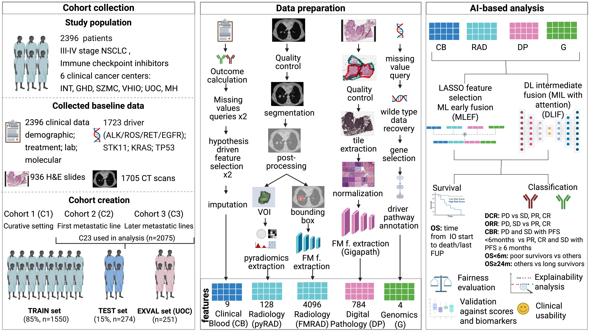

# I3LUNG_PDSS

## Introduction

This is the repository for the I3LUNG_PDSS project, which includes two main pipelines for analyzing medical data using machine learning and deep learning techniques. The two pipelines are:
1. Machine Learning Early Fusion (MLEF) Pipeline
2. Deep Learning Intermediate Fusion (DLIF) Pipeline

<p align="center">
	
</p>

## How to Run

### Prerequisites

Before running either pipeline, you must place your data in the following directory:

```
I3LUNG_PDSS/data/
```

Ensure this directory exists and contains all necessary data files before proceeding.

---

### Pipelines

The I3LUNG_PDSS repository contains two main pipelines for analysis:

### 1. Machine Learning Early Fusion (MLEF) Pipeline

The MLEF pipeline implements machine learning approaches with early fusion of features.

**To run this pipeline**, please refer to the detailed instructions in:
- [`mlef_pipeline/README.md`](mlef_pipeline/README.md)

### 2. Deep Learning Intermediate Fusion (DLIF) Pipeline

The DLIF pipeline implements deep learning approaches with intermediate fusion of features.

**To run this pipeline**, please refer to the detailed instructions in:
- [`dlif_pipeline/README.md`](dlif_pipeline/README.md)

---

## Visualization Notebooks

In addition to the two main pipelines, the repository includes several Jupyter notebooks for data visualization and analysis:

All of the notebooks can be run with the `mlef` conda environment (you can find installation instructions in [`mlef_pipeline/README.md`](mlef_pipeline/README.md)).

- **`data_visualization.ipynb`** - General data visualization and exploration
- **`graphs_classification.ipynb`** - Visualization of classification results
- **`graphs_survival_analysis.ipynb`** - Visualization of survival analysis results
- **`Metadata_Extraction.ipynb`** - Metadata extraction and analysis

These notebooks can be run independently to generate visualizations and analyze results from the pipelines.

Using **`Metadata_Extraction.ipynb`**, you can generate metadata distribution plots for each individual center as well as for all centers combined. It uses  metadata divided by center contained in **`data/Metadata_excelfiles.zip`**.

---

## Repository Structure

```
I3LUNG_PDSS/
├── mlef_pipeline/               # Machine Learning Early Fusion pipeline
│   └── README.md               # Detailed instructions for MLEF pipeline
├── dlif_pipeline/               # Deep Learning Intermediate Fusion pipeline
│   └── README.md               # Detailed instructions for DLIF pipeline
├── data/                        # Data directory (user must populate)
├── data_visualization.ipynb     # Data visualization notebook
├── graphs_classification.ipynb  # Classification results visualization
├── graphs_survival_analysis.ipynb  # Survival analysis visualization
├── Metadata_Extraction.ipynb    # Metadata extraction notebook
└── README.md                    # This file
```